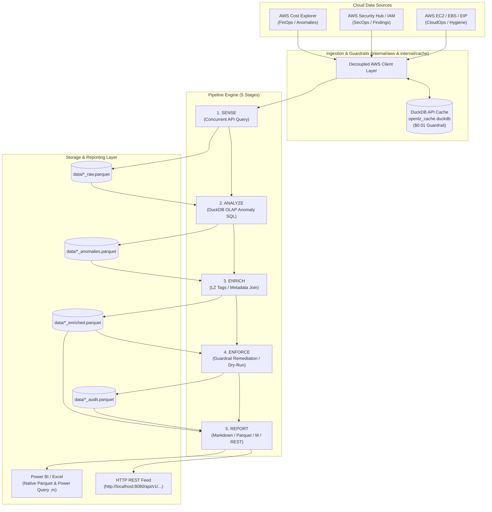
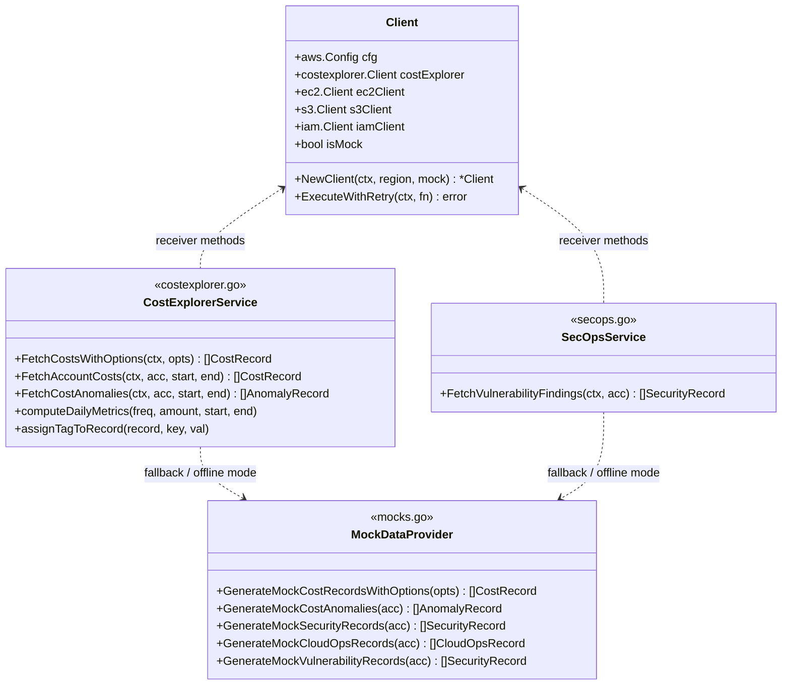

# OpenLZ Architecture

**OpenLZ (Open Landing Zone)** is a high-performance, modular, Zero-ETL Cloud Operations platform for enterprise AWS Landing Zones. It unifies **FinOps**, **SecOps**, and **CloudOps** into a single pipeline driven by an embedded [DuckDB](https://duckdb.org) engine, emitting partitioned Parquet datasets and Power Query (`.m`) feeds for Microsoft Power BI and Excel.

---

## 1. High-Level System Architecture

---

## 2. Decoupled AWS Client Architecture (`internal/aws`)

To prevent the "God Client" anti-pattern, the AWS integration layer is strictly split by domain responsibility:

- **`client.go`**: Pure SDK configuration, credential loading, regional default (`ap-southeast-1` / `us-east-1`), and resilient exponential backoff retries (`ExecuteWithRetry`).
- **`costexplorer.go`**: FinOps query builder, `LINKED_ACCOUNT` grouping, `RECORD_TYPE` discount/credit exclusion filters, Landing Zone tag parsers, and comparable daily metric normalization.
- **`secops.go`**: Security Hub and vulnerability findings querying.
- **`mocks.go`**: Offline simulation generators for all domains, fully isolated from real API query logic.

---

## 3. The 5 Pipeline Stages

Every operational domain (**FinOps**, **SecOps**, **CloudOps**) adheres to the same 5-stage lifecycle:

| Stage | Name | Responsibility | Primary Input | Primary Output |
| :--- | :--- | :--- | :--- | :--- |
| **1** | **Sense** | Concurrent query of cloud APIs or mock generators; writes raw records into DuckDB. | CLI flags / Cloud APIs | `data/*_raw.parquet` |
| **2** | **Analyze** | OLAP SQL execution in DuckDB to compute variances, deviations, spikes, and hygiene anomalies. | `*_raw.parquet` | `*_anomalies.parquet` |
| **3** | **Enrich** | Joins findings with Landing Zone governance context (BusinessUnit, Project, App, Environment, Owner). | `*_anomalies.parquet` | `*_enriched.parquet` |
| **4** | **Enforce** | Evaluates guardrail compliance; audits non-compliant resources (with `--dry-run` simulation by default). | `*_enriched.parquet` | `*_audit.parquet` |
| **5** | **Report** | Emits human-readable reports (console table, Markdown), Power Query `.m` scripts, and HTTP REST feeds. | `*_enriched.parquet` | Markdown / Console / Power BI / REST |

---

## 4. FinOps Multi-Account Architecture

### A. Ingestion Modes
1. **Consolidated Billing Payer Mode** (`--payer-account <ID>`):
   - Queries AWS Cost Explorer from the Management/Payer account using `GroupDefinitionTypeDimension: LINKED_ACCOUNT`.
   - Avoids making hundreds of separate cross-account API calls, substantially reducing query time and AWS API cost.
2. **Individual Linked Account Mode** (`--accounts <ID1,ID2,...>`):
   - Uses `internal/workflow/scanner.go` to scan accounts concurrently via `golang.org/x/sync/errgroup` with configurable concurrency (default: 5).

### B. Landing Zone Governance Tag Grouping
Cost records are grouped by core Landing Zone tag keys:
- `BusinessUnit`
- `Project`
- `Application`
- `Environment`

Records are tagged both in structured columns (`business_unit`, `project`, `application`, `environment`) and serialized into a DuckDB `tags JSON` column for flexible ad-hoc querying.

### C. Comparable Daily Normalization (`DailyAmount`)
AWS Cost Explorer allows querying across multiple granularities (`HOURLY`, `DAILY`, `MONTHLY`) and metrics (`UnblendedCost`, `AmortizedCost`, `UsageQuantity`). To enable seamless comparisons across frequencies:

$$\text{DailyAmount} = \begin{cases} 
\text{Amount} \times 24.0 & \text{for HOURLY (24-hour run-rate baseline, } \text{DaysInPeriod} = 1/24\text{)} \\
\text{Amount} & \text{for DAILY (} \text{DaysInPeriod} = 1.0\text{)} \\
\frac{\text{Amount}}{\text{DaysInPeriod}} & \text{for MONTHLY (where } \text{DaysInPeriod} = \text{days in calendar month or elapsed days)}
\end{cases}$$

---

## 5. Storage & Parquet Schemas

All intermediate and final datasets are stored as columnar Apache Parquet files generated by DuckDB's native Parquet writer.

### `raw_finops` Parquet Schema (20 Columns)

| Column | Type | Description |
| :--- | :--- | :--- |
| `account_id` | `VARCHAR` | AWS 12-digit Account ID |
| `account_name` | `VARCHAR` | Landing Zone friendly account name |
| `service` | `VARCHAR` | AWS Service name (e.g. `Amazon Elastic Compute Cloud - Compute`) |
| `usage_date` | `VARCHAR` | Date in `YYYY-MM-DD` |
| `usage_period` | `VARCHAR` | Granular period identifier (`YYYY-MM-DDTHH:00:00Z`, `YYYY-MM-DD`, `YYYY-MM`) |
| `amount` | `DOUBLE` | Raw period metric value |
| `daily_amount` | `DOUBLE` | **Normalized daily comparable cost or usage** |
| `days_in_period`| `DOUBLE` | Exact period length (`0.04167`, `1.0`, or `28.0`–`31.0`) |
| `metric` | `VARCHAR` | Metric queried (`UnblendedCost`, `AmortizedCost`, `UsageQuantity`) |
| `frequency` | `VARCHAR` | Frequency queried (`HOURLY`, `DAILY`, `MONTHLY`) |
| `unit` | `VARCHAR` | Unit of measurement (`USD`, `Hours`, `GB-Mo`, `Requests`) |
| `currency` | `VARCHAR` | Currency code (`USD`) |
| `region` | `VARCHAR` | AWS Region (e.g. `ap-southeast-1`) |
| `usage_type` | `VARCHAR` | AWS Usage Type string |
| `primary_tag` | `VARCHAR` | Primary governance tag (Level 1, e.g. Project) |
| `secondary_tag` | `VARCHAR` | Secondary governance tag (Level 2, e.g. Application) |
| `recorded_at` | `DATETIME` | Ingestion timestamp |

---

## 6. Power BI & Excel Integration Layer

OpenLZ provides zero-friction integration with Microsoft business intelligence tools:

1. **Direct Parquet / CSV Load**:
   - DuckDB writes optimized Snappy-compressed Parquet files.
2. **Auto-Generated Power Query (`.m`) Scripts**:
   - `internal/powerquery/generator.go` produces ready-to-paste Power Query M code for Power BI Desktop and Excel Advanced Editor.
3. **Embedded HTTP REST Server (`internal/rest/server.go`)**:
   - Launches a lightweight local web server (`openlz report serve --port 8080`) providing:
     - `GET /api/v1/finops` (JSON or CSV via `?format=csv`)
     - `GET /api/v1/secops`
     - `GET /api/v1/cloudops`
   - Enables scheduled "Get Data $\rightarrow$ From Web" background refreshes in Power BI Service and Excel Online.

---

## 7. CLI Binary Layout

The repository builds into four distinct binaries:

| Binary | Source Directory | Primary Purpose |
| :--- | :--- | :--- |
| `openlz` | `main.go`, `cmd/` | Unified CLI with full pipeline orchestrator (`openlz pipeline`) and cross-domain commands. |
| `openlz-finops` | `cmd/openlz-finops/` | Standalone, lightweight FinOps binary for cloud financial management teams and CI/CD jobs. |
| `openlz-secops` | `cmd/openlz-secops/` | Standalone SecOps binary for security posture and vulnerability scanning. |
| `openlz-cloudops` | `cmd/openlz-cloudops/`| Standalone CloudOps binary for waste detection and operational hygiene. |
